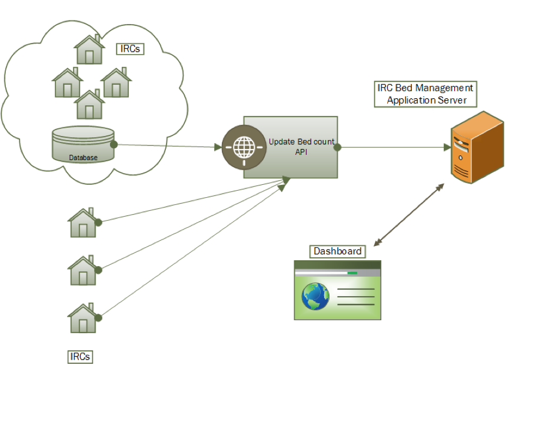

# IRC Capacity Management Interface Control Document and schema

## Purpose and Scope
This document describes the interface between IRC Capacity Management and its data providers
The purpose of the document is to detail the interactions available between each IRC platform and the Home Office dashboard for Bed Allocation by DEPMU and describes the metadata and security arrangements for the data.

## OWNERSHIP AND CONTROL

### ICD Ownership
This ICD is currently owned by the IRC Capacity Management team at the Home Office.

### ICD Maintenance Policy
Proposed changes to this ICD and schema will be managed via [Github pull requests](https://help.github.com/articles/using-pull-requests/) on this repository.
Non-material changes such as spelling mistakes or clarifications of existing capabilities shall be reviewed by the Capacity Management Team and merged to the master branch.

Any backwards compatible changes will be reviewed by the IRC Capacity Management Team as part of ongoing development of the service and merged.
If consumers of the interface are required to make use of the introduced functionality, they will be commercially engaged to do so.

Any breaking changes will be prepared on a branch by the Capacity Management Team.
Consumers of the interface will be commercially engaged to review, agree and prepare for the change prior to it being merged and introduced to the live service.

It is not anticipated that there will be any breaking changes made to this interface.
Any significant changes are likely to be made by introducing a new version of the API and engaging consumers individually to discuss migration.


## Interface Context

### Business Context
The aim of this interface is to support the processing of updates of bed occupancy and events logged in the IRCs that DEPMU operate.
The business require a technology that will aggregate, store and display data in a secure manner that is highly resilient and available.

### Conceptual Architecture Diagram

Programming interactions between IRCs and the DEPMU Bed Management Dashboard will be through a common API.

[diagram]


The API presents the following HTTP endpoints:
- `/irc_entry/<centre name>/event`
- `/irc_entry/<centre name>/heartbeat`

## Authentication

All new clients must be authenticated in order to use API endpoints.
Existing clients may use their existing unauthenticated endpoints but should migrate to authentication as soon as feasible.
This document describes the authenticated API only.

Authentication to the IRC Capacity Management API is via a Client Credentials OpenID Connect grant, as described in IETF RFC 6749 §4.4.
Clients must present their credentials to the authenticating endpoint in exchange for a bearer token.

The bearer token is time-limited and must be renewed after a period of time.


#### Obtaining credentials

Clients should request credentials from the IRC Capacity Management team, providing a PGP public key.
In return, they will receive a JSON file containing the information needed to request an access token for a certain Immigration Removal Centre.

If your credentials are compromised or otherwise no longer secure, you must contact the IRC Capacity Management team at the Home Office to request new ones.

#### Obtaining a token

Clients must make a POST request to an endpoint to obtain their OIDC access token.
The URL should be constructed from the information given in the JSON file provided in the following fashion:

```
<auth-server-url>/realms/<realm>/protocol/openid-connect/token
```

Clients should authenticate to this endpoint using the Basic authentication scheme described in [RFC 2617](https://tools.ietf.org/html/rfc2617#section-2).
The userid should be taken from the `resource` value, and the password from `credentials.secret`, of the JSON file.

The POST request must contain the parameter `grant_type=credentials` and an appropriate `Content-Type` header.

A successful request will return a JSON response containing the `access_token` which should be presented to the other endpoints.

#### Invoking the APIs

To invoke the other endpoints, clients must present a valid access token.
This should be included in every request to a protected endpoint via an `Authorization: Bearer` header as described in [RFC 6750](https://tools.ietf.org/html/rfc6750#section-2.1).

Access tokens expire after a certain period of time, after which a new token must be requested.
The expiry period for a given token is listed in the JSON response of the token request.
It is also embedded within the access token (a [JSON web token](https://jwt.io/)).

## Event API
Invoked on the following events by the IRC:

1. When a detainee checked in IRC.
2. When a detainee checked out IRC.
3. When a bed becomes out of operation.
4. When a bed returns into operation.
5. When a detainee is moved between moved between two sites by the IRC.
6. When a detainee is reinstated.
7. When a detainee cid/gender/nationality is updated.

##### Process flow:
- Capture the data required as described in the schema
- Validate data with the [schema](./event.json)
- Submit to the correct endpoint (as provided to the provider) over HTTPS/TLS including authentication headers
- Should an error occur submitting, queue the event, and retry the queue at `1 minute` intervals raising exceptions to the relevant support party so that it can be addressed and monitored
  - timeout should be set to 5 seconds
  - `3xx` redirects should be followed
  - should a `4xx` or `5xx` error occur,
  - consider ultimately anything (after any redirects) that result in a non `2xx` status code to be an error

## Heartbeat API
The purpose of this is to provide always up to date total bed count, bed occupation and out of commission information.

Invoked at `1 minute` intervals.
##### Process flow:
- Capture the data required as described in the schema. NOTE: The total bed count attributes are optional for backwards compatibility but must be populated by all new API consumers. They will be made mandatory in a future release.
- Validate data with the [schema](./heartbeat.json)
- Submit to the correct endpoint (as provided to the provider) over HTTPS/TLS
- Should an error occur submitting *do not queue* and raise the exception to the relevant support party so that it can be addressed and monitored.
  - Timeout should be set to 5 seconds
  - `3xx` redirects should be followed
  - Consider ultimately anything (after any redirects) that result in a non `2xx` status code to be an error

# Utilities
[](https://travis-ci.org/UKHomeOffice/removals_schema)

In this repository you will also find a tool that can be used to generate fake data which can be useful for testing and exploring the schema.
### To output 10 events to stdout
```shell
node generate.js event.json 10
```
### To output 10 heartbeats to stdout
```shell
node generate.js heartbeat.json 10
```
You can also include tagged releases of the repository in your application.
